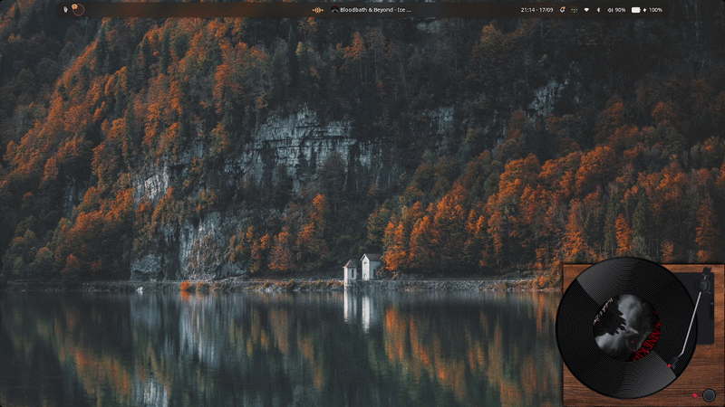
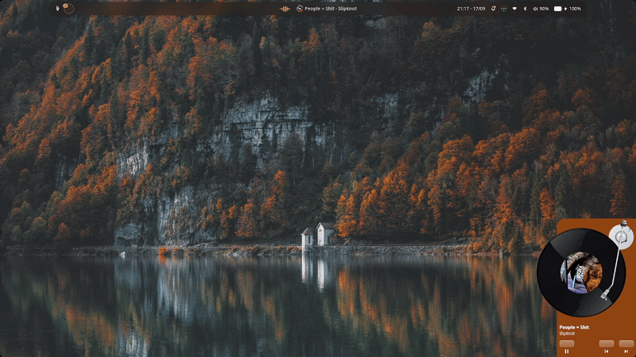
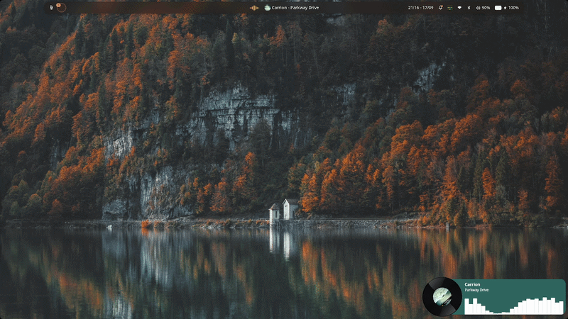

# CapyPlayer

CapyPlayer is a customizable desktop media widget for Wayland compositors, built with Rust and the Slint UI toolkit bridged with the [Spell framework](https://github.com/VimYoung/Spell). It interfaces with media players via the MPRIS D-Bus specification to display real-time playback states, album artwork, dynamic color palettes, and audio visualization directly on desktop surface layers.

> [!WARNING]
> CapyPlayer is currently in an early development stage and depends on an out-of-tree fork of the `spell-framework`. APIs, architecture, and configuration structures are actively evolving.

--- 

## Available Skins

CapyPlayer features multiple modular skins. Visual layouts adapt dynamically to album art, color extraction, and playback status.

### Realistic Vinyl Player
A skeuomorphic turntable layout. It includes a singular button to play/pause the current track &.



### Compact Vinyl Player
A streamlined, vertically oriented deck designed for compact screen real estate or sidebar placement.
It includes play/pause, next & previous buttons.



### Vinyl Card
A sleek horizontal card showcasing track metadata, vinyl album art and an audio visualizer.
Clicking on the vinyl will hide the rest of the card, only displaying the vinyl.



---

## Customizing & Creating Skins

Skins in CapyPlayer are completely modular and decoupled from application logic. All UI layouts are defined using Slint markup in the `ui/skins/` directory.

Each skin receives:
- `MediaData`: Track title, artist, album, extracted primary/secondary colors, cover art, and playback state.
- `AnimationState`: Normalized vinyl rotation angle, animation phase, and visualizer frequency bins.
- Standard callbacks for transport controls (`play_pause`, `next`, `prev`, `seek`).

### Creating a New Skin
1. Create a new directory in `ui/skins/<skin-name>/`.
2. Implement your component conforming to the properties and callbacks defined in `ui/skins/base-skin.slint`.
3. Register the skin dimensions and configuration in `ui/skins/skin_registry.slint`.
4. Export and instantiate your component in `ui/capy-spell-player.slint`.

Skin contributions and theme submissions are always welcome. Feel free to open a pull request with your custom skins.

>[!NOTE]
> Skin registration will be more streamlined in the future.

---

## Configuration & Hot Reloading

CapyPlayer automatically manages its configuration file at:
```
~/.config/capy-player/config.toml
```
If it doesn't exist yet, it will be automatically created at first run.

### Configuration Options

```toml
# Active skin selection
skin = "realistic-vinyl-player"
```

Supported `skin` values:
- `"realistic-vinyl-player"`
- `"compact-vinyl-player"`
- `"vinyl-card"`

Changes made to `config.toml` while CapyPlayer is running are hot-reloaded automatically.


---

## Tech Stack & Prerequisites

### Technical Requirements
- **Rust Toolchain**: Rust 2024 edition (1.85+ recommended).
- **Compositor**: Wayland compositor with `wlr-layer-shell` support (Hyprland, Sway, Niri, River, etc.).
- **D-Bus**: Active session bus with an MPRIS-compatible media player (Spotify, Firefox, mpv, etc.).
- **Audio Visualizer (Optional)**: `cava` installed and available in `$PATH` for spectrum visualization.


### Workspace Crates

- **`capy-mpris`** (`crates/capy-mpris`): Standalone MPRIS client built on `zbus`. Uses a single persistent D-Bus connection to avoid handle leaks, provides client-side playback interpolation, and supports player prioritization.
- **`capy-player`** (`crates/capy-player`): Core backend orchestrator. Handles artwork downloading/caching, background blur generation, Material 3 dynamic color extraction, and CAVA audio visualizer streams. Ideal for desktop shells or widgets.
- **`capy-config`** (`crates/capy-config`): Generic TOML configuration manager with asynchronous filesystem watching for automatic hot-reloading.

### System Libraries
Ensure development packages for standard graphical dependencies are installed:
- `fontconfig` / `freetype`
- `wayland-client`
- `libxkbcommon`
- `mesa` / `vulkan-loader` (for Skia rendering)


---

## Getting Started

### 1. Clone the Repository
```bash
git clone https://github.com/dotsem/CapyPlayer.git
cd CapyPlayer
```

>[!WARNING]
> Currently the project depends on an out-of-tree fork of the `spell-framework`, so this should also be present locally.
> [https://github.com/dotsem/Spell/tree/fix/set_size-function-doesn't-update-slint-%26-wayland-window-size](https://github.com/dotsem/Spell/tree/fix/set_size-function-doesn't-update-slint-%26-wayland-window-size)

### 2. Build and Run
```bash
# Debug run
cargo run

# Optimized release build
cargo run --release
```

---

## Roadmap

The project is under active development. Planned features include:

- Upstreaming and stabilizing the `spell-framework` integration for publishing to crates.io.
- Standalone window mode (support for standard X11/Wayland desktop windows alongside layer-shell widgets).
- Extended audio DSP integration and configurable spectrum visualizer presets.
- Multi-source MPRIS prioritization, active player switching, and volume control sliders.
- Additional default skins and community theme repositories.

---

## Contributing

Contributions are always welcomed! Please adhere to the following development standards:

1. **Branches**: Create feature branches from `main` (`feature/new-skin`, `fix/mpris-sync`).
2. **Formatting & Linting**:
   ```bash
   cargo fmt --check
   ```
3. **Slint Layouts**: Ensure all Slint files conform to atomic component structures and reuse models defined in `ui/models/`.
4. **Pull Requests**: Provide detailed descriptions and attach screenshots or GIFs for any UI or skin modifications.

---

## License

This project is distributed under the MIT License. See [LICENSE](LICENSE) for details.
